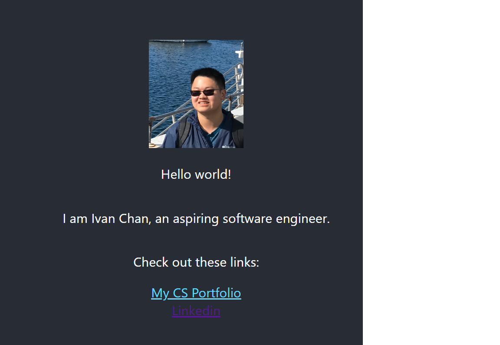

# My React App

This is my first React App.
This project was bootstrapped with [Create React App](https://github.com/facebook/create-react-app).

## Available Scripts
I used Visual Studios to edit the code.

In the project directory, you can run:

### `npm start`
Make sure you install npm if you haven't already:

[IBM npm Tutorial](https://developer.ibm.com/tutorials/learn-nodejs-installing-node-nvm-and-vscode/)

After going to the folder where the files are located, run the program using npm start.

Runs the app in the development mode.\
Open [http://localhost:3000](http://localhost:3000) to view it in your browser.

The page will reload when you make changes.\
You may also see any lint errors in the console.

## Learn More about React
See the [Create React App documentation](https://facebook.github.io/create-react-app/docs/getting-started).

To learn React, check out the [React documentation](https://reactjs.org/).

